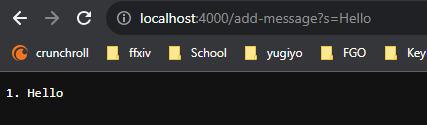
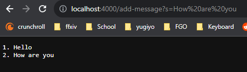
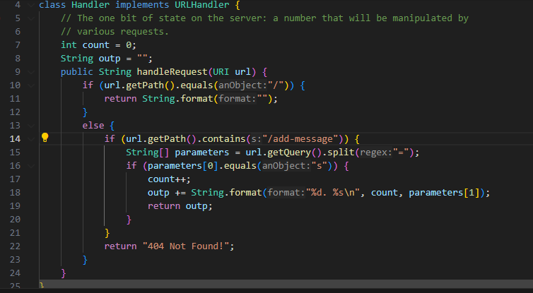
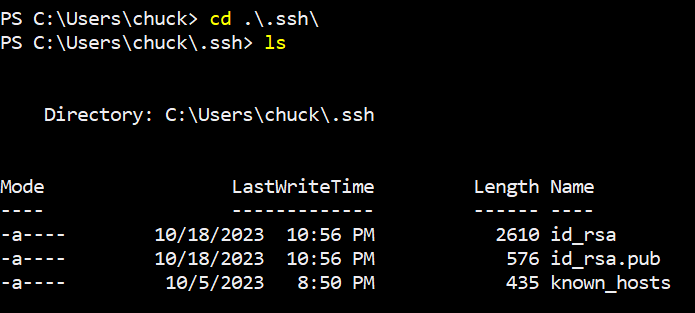
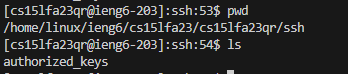
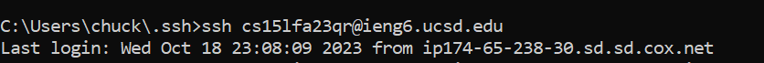

**PART 1**

Adding hello to the messages:

Adding how are you to the messages:

The part that I coded in so this could work:

Explanation:
Some methods that were called in my code are handleRequest and main.

Within the handleRequest method, I used an if statement to format the webpage, then an else if statement to detect if the path includes `/add-message`.
Inside the `/add-message` we have a `String[] parameters = url.getQuery().split("=")` which would detect when you would use a query in the weblink.
In the next line, we have another `if` statement which would look to see if we have s in our query to make sure we are going to get the next parameter for our output.
The next 3 lines I used within this `if` statement increased the count variable so I would have a number next to the message increasing after every new message.
`outp += String.format("%d. %s\n", count, parameters[1])` would add the string to outp which would allow us to view every input we put into the weblink using `/add-message`.
Lastly, we have `return outp` which would return whatever we inputted while using the `/add-message`.

Within the main method, we were given this code, but essentially it would look for a number between 1024 - 49151 for a port number when you first run the StringServer command
Example: `java StringServer 4000`
This would create a webpage that uses the port number 4000, so when we look up our webpage we would look up `localhost:4000`.

**PART 2**

Path to the private key(on local computer):

Path to the public key(within our `ieng6` account):

Shows we don't need to use a password to log into our `ieng6` account:

**PART 3**

Throughout weeks 2-3 I learned how to properly navigate through my directories using the terminal. I also learned new commands such as ssh, scp, and mkdir.
ssh meaning secure shell allows me to remotely access a server using a stable internet connection.
scp meaning secure copy allows me to copy a file that is on my computer to a remote computer, we are also able to do vice versa for this as well where we could copy a file from the remote computer to our local computer
mkdir meaning make directory which would literally make a directory in the directory we are in.

