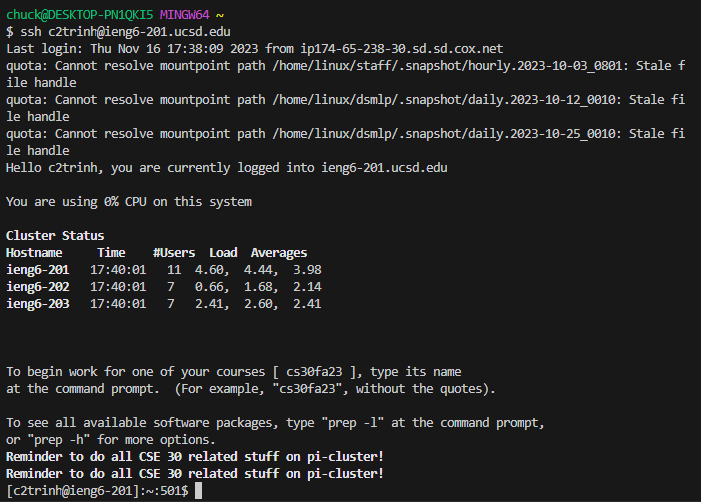
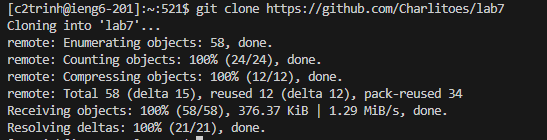
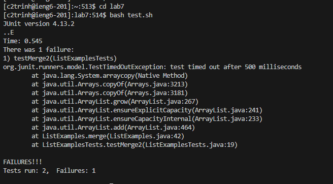
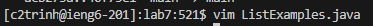
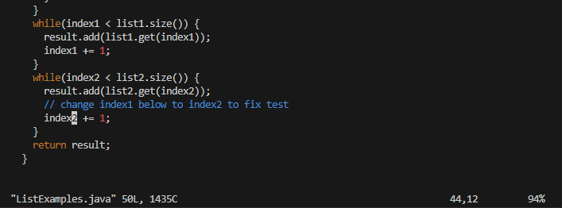
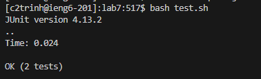
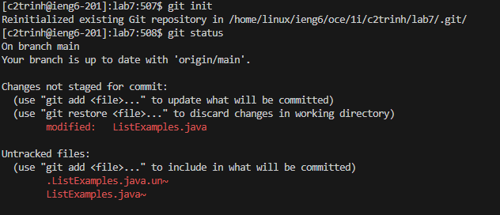
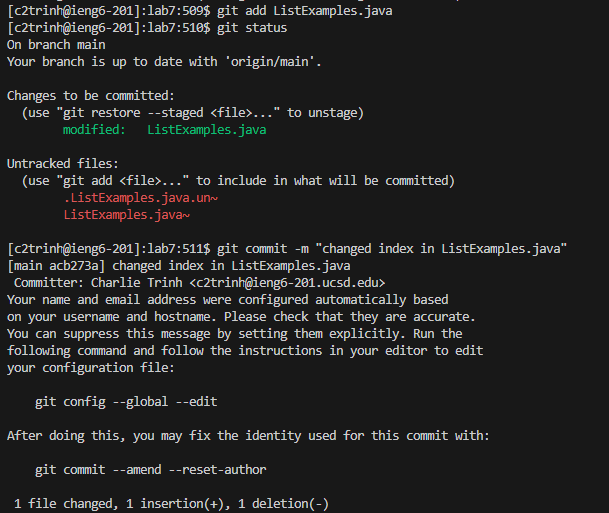
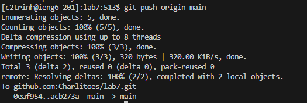

**VIM**


Steps 4-9


4) **Log into ieng6**


I typed all of this out `ssh c2trinh@ieng6-201.ucsd.edu`



5) **Clone your fork of the repository from your Github account (using the SSH URL)**


I copy and pasted this `git clone https://github.com/Charlitoes/lab7`



6) **Run the tests, demonstrating that they fail**


```
cd l<tab>
bash t<tab>
```



7) **Edit the code file to fix the failing test**


```
vim Li<tab>.java
```



*inside vim*


</index1><enter><n><n><n><n><n><n><n><n><n><l><l><l><l><l><r><2><:wq>





8) **Run the tests, demonstrating that they now succeed**


<up><up><up><enter>



9) **Commit and push the resulting change to your Github account (you can pick any commit message!)**


In all the codeblocks i typed it all out by hand with no special shortcuts


```
git init
git status
```



```
git add ListExamples.java
git status
```



```
git commit -m "changed index in ListExamples.java"
git push origin main
```



An image of the changed index in GitHub


