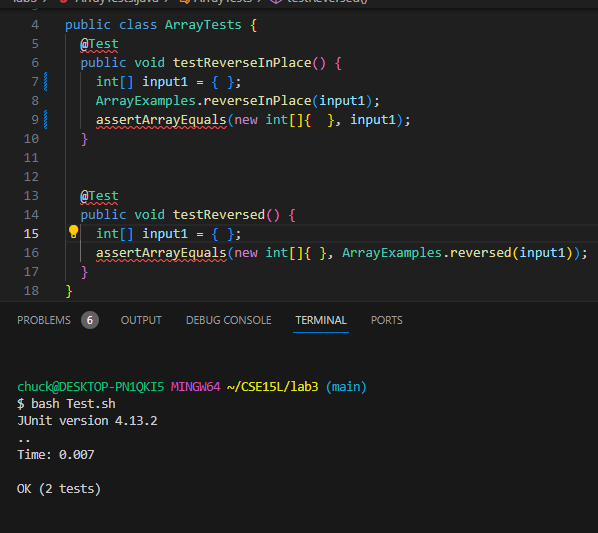
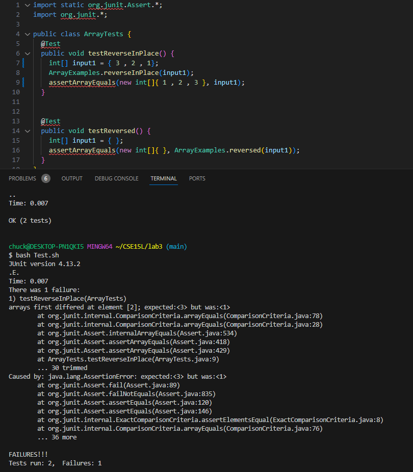

**Part 1: Bugs**

A failure-inducing input for the buggy `ArrayTests.java` program would be if we were to put more than 1 number in the array
in the `testReverseInPlace` function. 

**Example of the function:**
```
   public void testReverseInPlace() {
	int[] input1 = { 3 , 4, 5};
	ArrayExamples.reverseInPlace(input1);
	assertArrayEquals(new int[]{ 5, 4, 3 }, input1);
}
```

This would give us a test failure since the `reverseInPlace` method isn't actually reversing the array. 


An input that wouldn't produce a failure in the `ArrayTests.java` program would be if we were to put no elements or 1 element
in the array 

**Example of the function: **
```
   public void testReverseInPlace() {
	int[] input1 = { };
	ArrayExamples.reverseInPlace(input1);
	assertArrayEquals(new int[]{ }, input1);
}
```

The reason for this is that since there is nothing to be reversed or if there were only 1 element there wouldn't be any
change within the array itself and it would stay the same. 

**Screenshots of the tests failing and passing with different values in the arrays:**

**The test passed with nothing in the array**




**The test failing with more than 1 thing in the array**




**The bug fixes before and after:**

**BEFORE:**
```
  static void reverseInPlace(int[] arr) {
    for(int i = 0; i < arr.length; i += 1) {
      arr[i] = arr[arr.length - i - 1];
    }
  }
```

**AFTER: **
```
static void reverseInPlace(int[] arr) {
    for(int i = 0; i < arr.length/2; i += 1) {
      int temp = arr[i];
      arr[i] = arr[arr.length - i - 1];
      arr[arr.length - i - 1] = temp;
    }
  }
```

I made this change so when we try to reverse the array the first half of the numbers don't get immediately overwritten when we are trying to reverse the array, another notable change I made was that I made the for loop run for half of the time since the changes I made
allows the array to change 2 numbers per iteration instead of 1 number per iteration. 


**Part 2: Researching commands**

I will be researching the command `find`

Some interesting ways I found using this command is

**Example 1:** `find ./technical -name "*.txt"`

We used this command line to find all of the files that are .txt files and list them all out to us.
```
chuck@DESKTOP-PN1QKI5 MINGW64 ~/CSE15L/lab3/docsearch/technical (main) $ find . -name "*.txt"
...
./plos/pmed.0020161.txt
./plos/pmed.0020162.txt
./plos/pmed.0020180.txt
./plos/pmed.0020181.txt
./plos/pmed.0020182.txt
./plos/pmed.0020187.txt
./plos/pmed.0020189.txt
./plos/pmed.0020191.txt
./plos/pmed.0020192.txt
./plos/pmed.0020194.txt
./plos/pmed.0020195.txt
./plos/pmed.0020196.txt
./plos/pmed.0020197.txt
./plos/pmed.0020198.txt
./plos/pmed.0020200.txt
./plos/pmed.0020201.txt
./plos/pmed.0020203.txt
./plos/pmed.0020206.txt
./plos/pmed.0020208.txt
./plos/pmed.0020209.txt
./plos/pmed.0020210.txt
./plos/pmed.0020212.txt
./plos/pmed.0020216.txt
./plos/pmed.0020226.txt
./plos/pmed.0020231.txt
./plos/pmed.0020232.txt
./plos/pmed.0020235.txt
./plos/pmed.0020236.txt
./plos/pmed.0020237.txt
./plos/pmed.0020238.txt
./plos/pmed.0020239.txt
./plos/pmed.0020242.txt
./plos/pmed.0020246.txt
./plos/pmed.0020247.txt
./plos/pmed.0020249.txt
./plos/pmed.0020257.txt
./plos/pmed.0020258.txt
./plos/pmed.0020268.txt
./plos/pmed.0020272.txt
./plos/pmed.0020273.txt
./plos/pmed.0020274.txt
./plos/pmed.0020275.txt
./plos/pmed.0020278.txt
./plos/pmed.0020281.txt
```
Since there are literally hundreds of `.txt` files I shorted the code block for the output by a significant margin. 

using this command line to look for directories is also an option since all we would have to do is change the `"*.txt"` to the directory we would like to find

**Example 2:** `find ./technical -name "biomed"`

```
chuck@DESKTOP-PN1QKI5 MINGW64 ~/CSE15L/lab3/docsearch/technical (main)
$ find ./technical -name "biomed"
./biomed
```

this printed out the `./biomed` directory since we are looking in the `./technical` directory there's only the `./biomed` directory within it.


**Example 3:** `find ./technical -type f -mtime +30`

This command line would print out any files that have been changed/edited in the past 30 days. 

```
chuck@DESKTOP-PN1QKI5 MINGW64 ~/CSE15L/lab3/docsearch/technical (main)
$ find ./technical -type f -mtime +30

```
Since there aren't any files that were changed in the past 30 days there would be no output. 

**Example 4:** `find ./technical -type d -mtime +30`
```
chuck@DESKTOP-PN1QKI5 MINGW64 ~/CSE15L/lab3/docsearch (main)
$ find ./technical -type d -mtime +30
```

This would allow us to see if any of the directories in `./technical` were changed in the past 30 days, since there were no changes to these directories in the past 30 days there isn't any output. 


**Example 5:** `find ./technical -type f -user chuck`

This command line would output all of the files that are in the `./technical` directory if they are in the user `"chuck"`
```
chuck@DESKTOP-PN1QKI5 MINGW64 ~/CSE15L/lab3/docsearch/technical (main)
$ find . -type f -user chuck
...
./plos/pmed.0020123.txt
./plos/pmed.0020140.txt
./plos/pmed.0020144.txt
./plos/pmed.0020145.txt
./plos/pmed.0020146.txt
./plos/pmed.0020148.txt
./plos/pmed.0020149.txt
./plos/pmed.0020150.txt
./plos/pmed.0020155.txt
./plos/pmed.0020157.txt
./plos/pmed.0020158.txt
./plos/pmed.0020160.txt
./plos/pmed.0020161.txt
./plos/pmed.0020162.txt
./plos/pmed.0020180.txt
./plos/pmed.0020181.txt
./plos/pmed.0020182.txt
./plos/pmed.0020187.txt
./plos/pmed.0020189.txt
./plos/pmed.0020191.txt
./plos/pmed.0020192.txt
./plos/pmed.0020194.txt
./plos/pmed.0020195.txt
./plos/pmed.0020196.txt
./plos/pmed.0020197.txt
./plos/pmed.0020198.txt
./plos/pmed.0020200.txt
./plos/pmed.0020201.txt
./plos/pmed.0020203.txt
./plos/pmed.0020206.txt
./plos/pmed.0020208.txt
./plos/pmed.0020209.txt
./plos/pmed.0020210.txt
./plos/pmed.0020212.txt
./plos/pmed.0020216.txt
./plos/pmed.0020226.txt
./plos/pmed.0020231.txt
./plos/pmed.0020232.txt
./plos/pmed.0020235.txt
./plos/pmed.0020236.txt
./plos/pmed.0020237.txt
./plos/pmed.0020238.txt
./plos/pmed.0020239.txt
./plos/pmed.0020242.txt
./plos/pmed.0020246.txt
./plos/pmed.0020247.txt
./plos/pmed.0020249.txt
./plos/pmed.0020257.txt
./plos/pmed.0020258.txt
./plos/pmed.0020268.txt
./plos/pmed.0020272.txt
./plos/pmed.0020273.txt
./plos/pmed.0020274.txt
./plos/pmed.0020275.txt
./plos/pmed.0020278.txt
./plos/pmed.0020281.txt
```

Again I didn't put the whole output since the output would literally take up hundreds of lines since its outputing all of the `.txt` files within the `./technical` directory. This would basically output the same thing as
`find ./technical -name "*.txt"` but this time we have one more condition that needs to be met which is that these files have to be owned by the user `"chuck"` if it isn't then there would be no output or an error.


**Example 6:** `find ./technical -type d -user chuck`
```
chuck@DESKTOP-PN1QKI5 MINGW64 ~/CSE15L/lab3/docsearch (main)
$ find ./technical -type d -user chuck
./technical
./technical/911report
./technical/biomed
./technical/government
./technical/government/About_LSC
./technical/government/Alcohol_Problems
./technical/government/Env_Prot_Agen
./technical/government/Gen_Account_Office
./technical/government/Media
./technical/government/Post_Rate_Comm
./technical/plos

```

This would output all the directories that are in the `./technical` directory and if they are owned by the user `"chuck"`.

**Example 7:** `find ./technical -type f -executable`
```
chuck@DESKTOP-PN1QKI5 MINGW64 ~/CSE15L/lab3/docsearch (main)
$ find ./technical -type f -executable

```

This command line would find all of the executable files within the `./technical` directory, but since there are no executable files in `./techincal` it would output nothing.

**Example 8:** `find ./technical -type d -executable`
```
chuck@DESKTOP-PN1QKI5 MINGW64 ~/CSE15L/lab3/docsearch (main)
$ find ./technical -type d -executable
./technical
./technical/911report
./technical/biomed
./technical/government
./technical/government/About_LSC
./technical/government/Alcohol_Problems
./technical/government/Env_Prot_Agen
./technical/government/Gen_Account_Office
./technical/government/Media
./technical/government/Post_Rate_Comm
./technical/plos
```

This command line would output any executable directories within the `./technical` directory. as we can see there are multiple directories that are in `./technical` which is the reason why we have an output for this
command line and not for the executable files command line we used in the example before. 

I used Google and lecture notes to find some different ways to use the find command.
I also used this website for reference https://www.tecmint.com/35-practical-examples-of-linux-find-command/
This website has dozens of command lines for the `find` command and many different ways to use them. 
