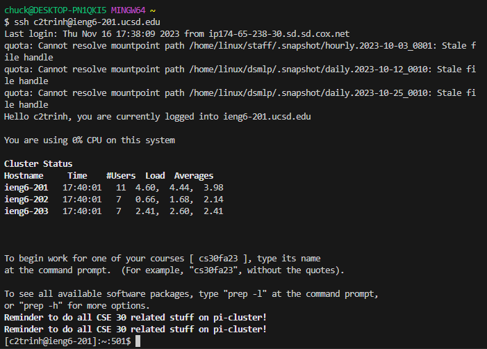

**PART 1**

Student submission:

Hello, this is Student, and I have a question about my code. I compiled and ran ListExamplesTests and ListExamples.java, but when I run the tests, I get a failing case and I feel like they're from the ListExamplesTests.java since it states that it cannot find the symbol for `@test` and I have no clue why. Here is a screenshot of the failing case and my ListExamples.java and ListExamplesTests.java for reference.

inputted screenshots:

TA response:

Hello, Student, from what I understand you are getting failing cases due to either not having junit on your current computer, or if you are using a windows machine the path to the junit destination needs to be changed a little bit in the test.sh file. The reason for this is due to the command being in the mac format since we created this repo on a macos machine. Another slight mistake I've could hint is that something in your ListExamples.java file is wrong. In regards for your junit destination change you could check week 4 and see the difference between the mac and windows commands and change your command to the windows one if youre using Windows.

Student response 2:

Thank you so much, I was able to figure out what that small bug was in ListExamples.java where I accidentally put `index1 += 1` for an index2 loop. I also completely forgot about how mac and Windows had different commands for this too.

Revised screenshots:

