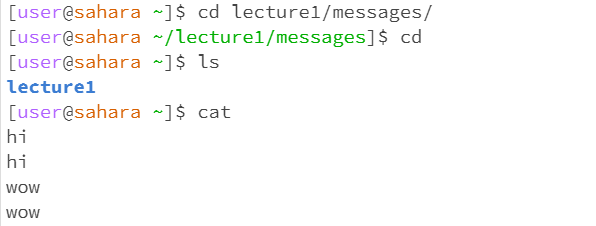
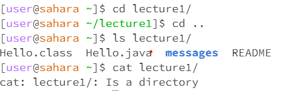
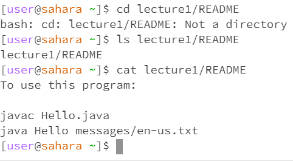

**Lab Report 1 - Remote Access and FileSystem**

1. Examples of cd, ls, and cat with no arguments
   
**cd** with no arguments would bring us back to our home directory

**ls** with no arguments would show all the directories and files that are within the home directory

**cat** with no arguments would allow us to print something then the console would print whatever we inputted

2. Examples of cd, ls, and cat with a path to a directory as an argument

**cd** with a path to a directory would take us to the directory that we inputted

**ls** with a path to a directory would show us the files/directories within the directory we inputted

**cat** with a path to a directory would tell us if the path we are going to is a directory.

3. Examples of cd, ls, and cat with a path to a file as an argument

**cd** with a path to a file would tell us that it isn't a directory since cd would only move us to directories

**ls** with a path to a file would tell us the file path

**cat** with a path to a file would print out what is stored inside the file.

